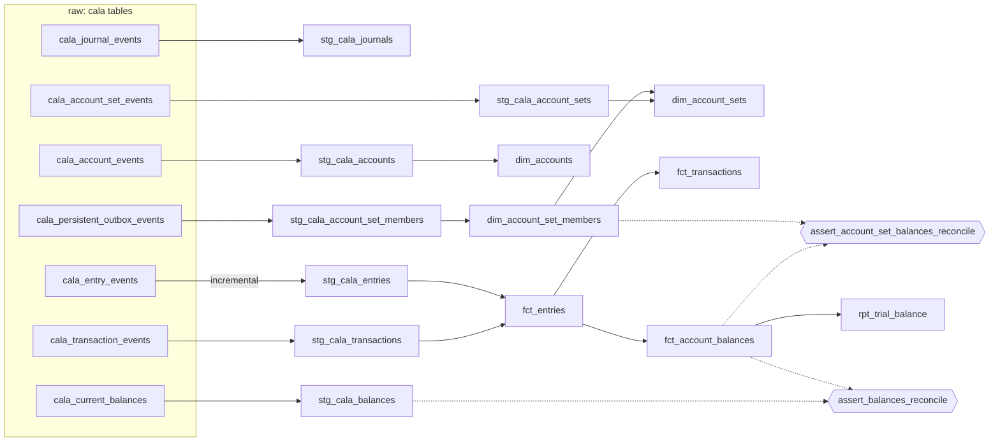

# cala-warehouse

A portable dbt package for modelling event-sourced ledger data from the Galoy
stack ([`es-entity`](https://github.com/GaloyMoney/es-entity) /
[`cala-ledger`](https://github.com/GaloyMoney/cala)), with a DuckDB harness so
the whole package builds and tests locally from committed seeds in a few
seconds, with no cloud credentials.

The models are competent, ordinary work. The point of the package is the
**tests**: a reconciliation suite that independently recomputes every balance
from raw double-entry lines and proves it equals what cala itself persisted.

```sh
make install   # uv sync
make build     # dbt seed, then dbt build: 17 seeds, 14 models, 63 tests, ~10s
make mcp       # read-only MCP server (stdio) over the marts; see "MCP server" below
```

## What it proves

The seeds are not invented. They are cala-ledger's own Postgres tables, dumped
after running cala's integration suite (`fixtures/generate.sh`, provenance in
[`fixtures/MANIFEST.md`](fixtures/MANIFEST.md)). Against those seeds:

| control | what it checks | result |
|---|---|---|
| `assert_debits_equal_credits` | per (transaction, currency): Σ debits = Σ credits | passes, 563 transactions |
| `assert_debits_equal_credits_per_layer` | the same, per (transaction, currency, **layer**) | passes; cala does not document this stricter invariant, it holds empirically |
| `assert_no_sequence_gaps` | per entity id, `sequence` is 1..n with no gaps, on all five event streams | passes; a completeness control |
| `assert_balances_reconcile` | balances rebuilt from entries = cala's `cala_current_balances`, full grain, exact decimals, zero tolerance | passes on 2,643 (journal, account, currency, layer) rows |
| `assert_account_set_balances_reconcile` | cala's account-set balances = our rollup through the recursive membership closure | passes on 78 set balance rows |

Plus a trial balance (`rpt_trial_balance`) whose `difference` column is zero on
all 101 (journal, currency, layer) rows, enforced by a test.

## Why this exists

`es-entity` gives every entity a mutable current-state table and an
append-only `*_events` stream with `UNIQUE(id, sequence)`. cala publishes a
typed outbox on top. That is a very good ingestion surface, and the ledger is
the part of the stack with the least warehouse modelling. In particular
nothing downstream *recomputes* balances; cala's own projection is ingested
and trusted. Two independent computations of the same number from the same
entries, compared with zero tolerance, is the control this package adds.

Everything here applies to any service on the es-entity stack, not only cala.

## Layout

```
fixtures/
  generate.sh          run cala's test suite in Docker, dump 17 tables to CSV
  manifest.sh          write MANIFEST.md (cala version, test results, row counts)
  seed/*.csv           the committed seeds (12 MB)
dbt/
  dbt_project.yml      seeds typed per table; UUIDs as strings, JSON as strings
  profiles.yml         targets: duckdb (default), bigquery
  macros/cross_db.sql  json_string / json_decimal / ... dispatch per adapter
  models/staging/      one model per event stream + the outbox + cala's balances
  models/marts/        dims, facts, trial balance; every column described in marts.yml
  tests/               the five controls above
mcp/
  cala_mcp/            the MCP server: manifest reader, read-only DuckDB, tools
  tests/               pytest over the built warehouse, incl. reconcile() == []
scripts/benchmark_incremental.py
.github/workflows/ci.yml   build: dbt seed + build; mcp-tests: the same, then pytest
```

### Lineage



## The source contract, in three rules

1. **Event streams are append-only and keyed on `(id, sequence)`.** Loading
   them incrementally is safe and idempotent. `stg_cala_entries` does this
   with a **per-id** watermark: every entity starts at sequence 1, so a global
   `max(sequence)` would silently drop every entity created after the first
   load.
2. **Current-state tables mutate in place.** A sequence watermark is wrong for
   them; replace or snapshot. This package only reads them for cala's own
   balance projection, which is treated as an external number to reconcile
   against, never as a source of truth to build on.
3. **The balance grain is `(journal_id, account_id, currency, layer)`.**
   Settled, pending and encumbrance are separate ledgers sharing an account.
   Summing across layers without saying so is a bug. `units` is
   `DECIMAL(38, 18)` on DuckDB and `BIGNUMERIC` on BigQuery; it is never a
   float anywhere in the pipeline.

## Models

**Staging** (`stg_cala_*`): one row per event. The event JSON is unpacked into
typed columns through the macros in `dbt/macros/cross_db.sql`, so the same
model compiles on DuckDB and BigQuery. `context` is kept on every row as
`event_context`: es-entity propagates request / trace / actor metadata into
it, so a warehouse row can be traced to the originating API call. (cala's test
suite sets no context, so the column is null in the fixtures.)

Account-set membership is not an entity event in cala; adds and removes exist
only on the outbox (`AccountSetMemberCreated` / `Removed`), so
`stg_cala_account_set_members` reads the outbox.

**Marts:**

- `fct_entries`: one row per double-entry line, with `debit_units` /
  `credit_units` split out so everything downstream is a plain sum.
- `fct_transactions`: one row per transaction with entry counts and an
  `is_balanced` flag.
- `fct_account_balances`: rebuilt from `fct_entries` at the full grain, signed
  by the account's normal balance side. Independent of cala's projection.
- `rpt_trial_balance`: per journal, currency and layer: total debits, total
  credits, difference.
- `dim_accounts`: SCD-2. The event stream *is* the change history, so there
  is no column diffing; cala's `fields` array on each `updated` event is
  surfaced as `changed_fields`.
- `dim_account_set_members`: membership replayed from the outbox, then a
  recursive walk to the transitive closure. A set can have several parents,
  so it is a DAG: `path` is part of the grain and the walk refuses to
  re-enter a set already on its path. The fixtures reach depth 16.
- `dim_account_sets`: one row per set with depth, parent and descendant counts.

## Findings from the fixtures

Things the tests surfaced that were not in the design brief:

- **Debits = credits holds per layer.** cala only documents the invariant per
  (transaction, currency). The stricter per-(transaction, currency, layer)
  test passes on every fixture transaction, so it ships as a test.
- **Set rollups are journal-scoped.** An account can be a member of sets in
  different journals, and cala only rolls a posting into ancestor sets in the
  posting's journal. The first version of the set reconciliation assumed sets
  and members share a journal and reported six phantom balances; cala's own
  test `a_multi_journal_batch_does_not_cross_ancestor_sets_between_journals`
  is what produced them. The test now scopes the rollup to the set's journal.
- **`dbt build` alone races on a fresh database.** Staging reads seeds through
  `source()`, which dbt does not order after seed loading. `make build` runs
  `dbt seed` first, then `dbt build --exclude resource_type:seed`.
- **No encumbrance-layer entries** occur in cala's suite; only settled and
  pending. The layer is modelled and tested but not exercised by data.

## Incremental vs full refresh

`scripts/benchmark_incremental.py` loads the same seeds four ways. Numbers from
a laptop; `model time` is dbt's execution time for the one model, `dbt wall`
includes dbt start-up.

| run | rows in table | rows written | model time (s) | dbt wall (s) |
|---|---:|---:|---:|---:|
| full refresh, first half (`entries_as_of`) | 1832 | 1832 | 0.28 | 8.1 |
| incremental, second half | 3286 | 1454 | 0.30 | 8.8 |
| full refresh, all events | 3286 | 3286 | 0.34 | 5.3 |
| incremental, no new events | 3286 | 0 | 0.31 | 5.2 |

At 3,286 rows nothing is slow, so wall time proves little. What the table
does show is the shape of the pattern: the incremental path writes exactly
the rows that are new (1,454, then 0) and the per-id watermark picked up the
second batch correctly. Its cost scales with new events, not with history.
This is only valid because `cala_entry_events` is append-only; the mutable
current-state tables must still be replaced.

## MCP server

`make mcp` starts a [Model Context Protocol](https://modelcontextprotocol.io)
server over the DuckDB file dbt produces, so an agent can ask ledger
questions in ledger terms instead of writing SQL against tables it has to
guess the meaning of. Five read-only tools:

| tool | answers |
|---|---|
| `describe_model(name)` | columns with descriptions and data types, grain, upstream / downstream models and tests, all from `dbt/target/manifest.json` |
| `list_models()` | every model with its grain and one-line description |
| `trial_balance(journal_id, as_of=None)` | `rpt_trial_balance` for one journal; with `as_of`, recomputed from `fct_entries` where `recorded_at <= as_of` |
| `explain_account_balance(account_id, currency, layer, journal_id=None, limit=200)` | the `fct_account_balances` row(s) and the ordered entry chain with running debit, credit and signed totals, plus cala's own figure for the grain |
| `reconcile(as_of=None, limit=500)` | the leaf and account-set reconciliation controls; `mismatches` is empty when green. With `as_of`, cala's side comes from `cala_balance_history` |

Rules the server keeps:

- **Grounded in the manifest.** Model names, relation names, columns, grain
  (`config.meta.grain`) and even the allowed values of `layer` come from
  `manifest.json`. A query cannot name a column the yml does not declare; if
  the manifest is missing the tool says so and stops.
- **Read-only by construction.** DuckDB is opened `read_only=True`, there is
  no SQL tool, and the parameters above are the whole surface.
- **Decimals stay decimals.** `DECIMAL(38,18)` values are returned as exact
  strings, never floats.

Point an MCP client at `uv run cala-mcp` with the repo as working directory
(`CALA_WAREHOUSE_MANIFEST` / `CALA_WAREHOUSE_DUCKDB` override the paths).
`make mcp-test` runs the suite; CI's `mcp-tests` job does the same after
`make build`.

### Finding: as-of reconciliation and backdated entries

`reconcile(as_of=...)` compares entries by their `recorded_at` with the
balance version cala had written by the same instant. Eight fixture grains
carry entries recorded with a 2025 timestamp (cala's tests post with explicit
dates) while cala wrote their balances on the day the fixtures were dumped.
Any `as_of` between those two instants reports them as `missing_in_cala`,
and the tool's caveats say so. That is not a bug in either side; it is the
difference between an event's timestamp and the time its projection was
written, and a production as-of comparison has to pick one axis and
snapshot both sides on it.

## Portability

`profiles.yml` has a `bigquery` target. Dialect differences live in
`dbt/macros/cross_db.sql` (`adapter.dispatch`), seeds are disabled off DuckDB
so fixtures never land on a real warehouse, and `sources.yml` names the same
tables an extractor would land. Untested against a live BigQuery project.

```sh
DBT_BIGQUERY_PROJECT=... DBT_BIGQUERY_DATASET=... TARGET=bigquery make run
```

## Regenerating the fixtures

```sh
make fixtures                 # needs Docker, psql, and cala at ../cala
make build FULL_REFRESH=1     # the incremental table must be rebuilt after seeds are replaced
```

`generate.sh` starts Postgres 18, runs `cargo test --workspace` for cala in a
`rust:1-bookworm` container (compile artefacts are cached in Docker volumes,
so the first run takes several minutes and later ones about one), dumps the
tables and writes `MANIFEST.md`. One cala test fails on a fresh database
(a migration bootstrap race in the first test to run); it writes no data and
is listed in the manifest rather than hidden.

## Out of scope, deliberately

No ingestion (this package starts at the landed tables), no orchestrator, no
erasure propagation. An append-only warehouse does not honour es-entity's
"forgettable" erasure requests; that is a real obligation once raw event JSON
is landed, and a good next project.

No auth on the MCP server either: it is a local stdio process over a local
file, which is the right shape for v1 and the wrong one for anything shared.

Ideas that follow from this one: an as-of membership closure so
`reconcile(as_of)` can rebuild set rollups at a past instant; a
`explain_transaction` tool walking a transaction's lines and the template
that produced them; the same tools over BigQuery once the package has run
there.

## Development

Built with Claude Code; see `CLAUDE.md` for the conventions that every model
and test follow, and the commit history for how it was put together.
