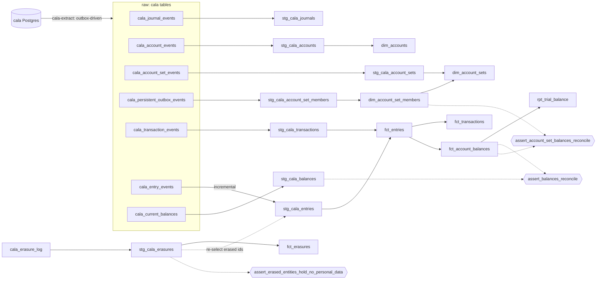

# cala-warehouse

A portable dbt package for modelling event-sourced ledger data from the Galoy
stack ([`es-entity`](https://github.com/GaloyMoney/es-entity) /
[`cala-ledger`](https://github.com/GaloyMoney/cala)), with a DuckDB harness so
the whole package builds and tests locally from committed seeds in a few
seconds, with no cloud credentials.

The models are competent, ordinary work. The point of the package is the
**tests**: a reconciliation suite that independently recomputes every balance
from raw double-entry lines and proves it equals what cala itself persisted.

```sh
make install   # uv sync
make build     # dbt seed, then dbt build: 17 seeds, 16 models, 75 tests, ~10s
make mcp       # read-only MCP server (stdio) over the marts; see "MCP server" below
make extract   # land the same 17 tables from a live cala Postgres; see "Extraction" below
make erase ARGS="account <uuid> --reason DSAR-42 --with-entries"   # see "Erasure propagation"
```

## What it proves

The seeds are not invented. They are cala-ledger's own Postgres tables, dumped
after running cala's integration suite (`fixtures/generate.sh`, provenance in
[`fixtures/MANIFEST.md`](fixtures/MANIFEST.md)). Against those seeds:

| control | what it checks | result |
|---|---|---|
| `assert_debits_equal_credits` | per (transaction, currency): Σ debits = Σ credits | passes, 563 transactions |
| `assert_debits_equal_credits_per_layer` | the same, per (transaction, currency, **layer**) | passes; cala does not document this stricter invariant, it holds empirically |
| `assert_no_sequence_gaps` | per entity id, `sequence` is 1..n with no gaps, on all five event streams | passes; a completeness control |
| `assert_balances_reconcile` | balances rebuilt from entries = cala's `cala_current_balances`, full grain, exact decimals, zero tolerance | passes on 2,643 (journal, account, currency, layer) rows |
| `assert_account_set_balances_reconcile` | cala's account-set balances = our rollup through the recursive membership closure | passes on 78 set balance rows |
| `assert_erased_entities_hold_no_personal_data` | every entity in the erasure log holds no value in its personal fields, in staging, marts, raw state tables and outbox payloads | passes; empty on the seeds, exercised in CI after an erasure |

Plus a trial balance (`rpt_trial_balance`) whose `difference` column is zero on
all 101 (journal, currency, layer) rows, enforced by a test.

## Why this exists

`es-entity` gives every entity a mutable current-state table and an
append-only `*_events` stream with `UNIQUE(id, sequence)`. cala publishes a
typed outbox on top. That is a very good ingestion surface, and the ledger is
the part of the stack with the least warehouse modelling. In particular
nothing downstream *recomputes* balances; cala's own projection is ingested
and trusted. Two independent computations of the same number from the same
entries, compared with zero tolerance, is the control this package adds.

Everything here applies to any service on the es-entity stack, not only cala.

## Layout

```
fixtures/
  generate.sh          run cala's test suite in Docker, dump 17 tables to CSV
  manifest.sh          write MANIFEST.md (cala version, test results, row counts)
  schema.sh            dump the DDL of those tables from cala's migrations
  schema.sql           the committed DDL; the extractor tests recreate cala from it
  seed/*.csv           the committed seeds (12 MB)
dbt/
  dbt_project.yml      seeds typed per table; UUIDs as strings, JSON as strings
  profiles.yml         targets: duckdb (default), bigquery
  macros/cross_db.sql  json_string / json_decimal / ... dispatch per adapter
  models/staging/      one model per event stream + the outbox + cala's balances
  models/marts/        dims, facts, trial balance, the erasure log; every column described in marts.yml
  tests/               the six controls above
mcp/
  cala_mcp/            the MCP server: manifest reader, read-only DuckDB, tools
  tests/               pytest over the built warehouse, incl. reconcile() == []
extract/
  cala_extract/        the extractor: outbox-driven dlt source, Postgres fixture loader, CLI;
                       erasure.py + erase.py: forget propagation and the cala-erase CLI
  tests/               pytest against a Postgres holding cala's DDL and the seeds
scripts/benchmark_incremental.py
.github/workflows/ci.yml   build: dbt seed + build; mcp-tests: the same, then pytest;
                           extract: Postgres service, extractor tests, then dbt + MCP on extracted tables
```

### Lineage



## The source contract, in three rules

1. **Event streams are append-only and keyed on `(id, sequence)`.** Loading
   them incrementally is safe and idempotent. `stg_cala_entries` does this
   with a **per-id** watermark: every entity starts at sequence 1, so a global
   `max(sequence)` would silently drop every entity created after the first
   load.
2. **Current-state tables mutate in place.** A sequence watermark is wrong for
   them; replace or snapshot. This package only reads them for cala's own
   balance projection, which is treated as an external number to reconcile
   against, never as a source of truth to build on.
3. **The balance grain is `(journal_id, account_id, currency, layer)`.**
   Settled, pending and encumbrance are separate ledgers sharing an account.
   Summing across layers without saying so is a bug. `units` is
   `DECIMAL(38, 18)` on DuckDB and `BIGNUMERIC` on BigQuery; it is never a
   float anywhere in the pipeline.

## Models

**Staging** (`stg_cala_*`): one row per event. The event JSON is unpacked into
typed columns through the macros in `dbt/macros/cross_db.sql`, so the same
model compiles on DuckDB and BigQuery. `context` is kept on every row as
`event_context`: es-entity propagates request / trace / actor metadata into
it, so a warehouse row can be traced to the originating API call. (cala's test
suite sets no context, so the column is null in the fixtures.)

Account-set membership is not an entity event in cala; adds and removes exist
only on the outbox (`AccountSetMemberCreated` / `Removed`), so
`stg_cala_account_set_members` reads the outbox.

**Marts:**

- `fct_entries`: one row per double-entry line, with `debit_units` /
  `credit_units` split out so everything downstream is a plain sum.
- `fct_transactions`: one row per transaction with entry counts and an
  `is_balanced` flag.
- `fct_account_balances`: rebuilt from `fct_entries` at the full grain, signed
  by the account's normal balance side. Independent of cala's projection.
- `rpt_trial_balance`: per journal, currency and layer: total debits, total
  credits, difference.
- `dim_accounts`: SCD-2. The event stream *is* the change history, so there
  is no column diffing; cala's `fields` array on each `updated` event is
  surfaced as `changed_fields`.
- `dim_account_set_members`: membership replayed from the outbox, then a
  recursive walk to the transitive closure. A set can have several parents,
  so it is a DAG: `path` is part of the grain and the walk refuses to
  re-enter a set already on its path. The fixtures reach depth 16.
- `dim_account_sets`: one row per set with depth, parent and descendant counts.

## Findings from the fixtures

Things the tests surfaced that were not in the design brief:

- **Debits = credits holds per layer.** cala only documents the invariant per
  (transaction, currency). The stricter per-(transaction, currency, layer)
  test passes on every fixture transaction, so it ships as a test.
- **Set rollups are journal-scoped.** An account can be a member of sets in
  different journals, and cala only rolls a posting into ancestor sets in the
  posting's journal. The first version of the set reconciliation assumed sets
  and members share a journal and reported six phantom balances; cala's own
  test `a_multi_journal_batch_does_not_cross_ancestor_sets_between_journals`
  is what produced them. The test now scopes the rollup to the set's journal.
- **`dbt build` alone races on a fresh database.** Staging reads seeds through
  `source()`, which dbt does not order after seed loading. `make build` runs
  `dbt seed` first, then `dbt build --exclude resource_type:seed`.
- **No encumbrance-layer entries** occur in cala's suite; only settled and
  pending. The layer is modelled and tested but not exercised by data.
- **`recorded_at` is not a cursor.** It is caller-supplied or transaction
  start time (see "Extraction"); 12 fixture entry events are dated a year
  before they were written. The outbox `sequence` is the cursor, and obix
  keeps it gap-free.
- **The outbox is not a complete change signal for templates.** One fixture
  template has two `initialized` events and one outbox row, and the outbox
  enum has no `TxTemplateUpdated`. Templates are immutable and tiny, so the
  extractor replaces that stream instead of keying it.
- **A snapshot's xmax is not a marker.** It is "latest completed xid + 1",
  and a running transaction can sit at or above it; the first version of
  the abandonment proof used it and passed while a transaction was still
  open. The marker is a real xid taken by an auto-commit statement after
  the snapshot, as obix does it.

## Incremental vs full refresh

`scripts/benchmark_incremental.py` loads the same seeds four ways. Numbers from
a laptop; `model time` is dbt's execution time for the one model, `dbt wall`
includes dbt start-up.

| run | rows in table | rows written | model time (s) | dbt wall (s) |
|---|---:|---:|---:|---:|
| full refresh, first half (`entries_as_of`) | 1832 | 1832 | 0.28 | 8.1 |
| incremental, second half | 3286 | 1454 | 0.30 | 8.8 |
| full refresh, all events | 3286 | 3286 | 0.34 | 5.3 |
| incremental, no new events | 3286 | 0 | 0.31 | 5.2 |

At 3,286 rows nothing is slow, so wall time proves little. What the table
does show is the shape of the pattern: the incremental path writes exactly
the rows that are new (1,454, then 0) and the per-id watermark picked up the
second batch correctly. Its cost scales with new events, not with history.
This is only valid because `cala_entry_events` is append-only; the mutable
current-state tables must still be replaced.

## Extraction

`make extract` lands the same 17 tables from a live cala Postgres into the
`raw` schema the staging models read, so the package runs on real data with
nothing changed downstream. It is a small [dlt](https://dlthub.com) source
(`extract/cala_extract/`), the extraction tool lana's platform already uses,
with two write dispositions that follow the source contract: `merge` for the
append-only streams, `replace` for the mutable state tables.

### Why the outbox is the cursor

The obvious incremental design, a watermark on `recorded_at`, is wrong for
es-entity tables, and it took reading the source to see why:

- `recorded_at` is written as `COALESCE($caller_supplied, NOW())`
  (`es-entity-macros/src/repo/create_fn.rs`). The application can backdate
  it, and cala's own tests do: the fixtures hold entry events dated
  2025-01-01 that were written on 2026-09-06. `NOW()` is also transaction
  *start* time, so even un-backdated rows do not commit in `recorded_at`
  order (142 inversions in the fixture outbox). A time cursor misses rows.
- The `*_events` tables have no other candidate: `sequence` restarts at 1
  per entity.
- The outbox's `sequence` is the one monotonic cursor in the schema: a
  `BIGSERIAL` primary key with `CACHE 1`, and obix (cala's outbox library)
  keeps it gap-free by inserting `payload NULL` placeholder rows for
  sequences whose transaction rolled back, after proving through the xmin
  horizon that no writer still owns them (`obix/src/out/gap_fill.rs`).
- Every entity write is announced on the outbox in the same transaction,
  with the entity id in the payload. On the seeds the coverage is complete:
  no id in any keyed stream is missing from the payloads that stream
  listens to (`test_every_stream_id_is_announced_on_the_outbox`).

So the extractor reads the outbox from its watermark, collects the entity
ids the payloads name, fetches those entities' `*_events` rows by key, and
merges on `(id, sequence)`. Two details from the source shaped the mapping:
an account set's backing account gets no `account_created` of its own (the
set's payload announces it), and `tx_template_events` is replaced rather
than keyed because the outbox has no `TxTemplateUpdated` variant and the
fixtures contain a template with two `initialized` events for one outbox row.

### What one run does

1. Open one `REPEATABLE READ, READ ONLY` transaction and take an xid marker
   the way obix's `abandonment_marker` does. Everything below is read from
   that snapshot, so the streams and the replaced state tables describe the
   same instant and the reconciliation controls hold after every run, not
   only when cala is idle.
2. Stream `outbox where sequence > watermark`, page by page; per page, fetch
   the announced entities' events. Land the outbox rows themselves too.
3. Replace the 11 state tables.
4. Advance the watermark only across a contiguous run of sequences. For a
   hole below the highest sequence seen, apply obix's proof in a fresh
   transaction: if `pg_snapshot_xmin(pg_current_snapshot()) > marker`, every
   transaction that could own the hole has ended; a sequence still absent
   is abandoned and skipped, one that appeared meanwhile is a late commit
   and the watermark stops before it. If the horizon has not passed, stop
   at the hole. Rows beyond a hole are still landed (they were in the
   snapshot) and re-read next run, which is harmless because the merge is
   idempotent.
5. With `--verify`, count every table in the snapshot and compare with the
   destination after the load.

`extract/tests/` runs all of this against a Postgres that holds cala's real
DDL (`fixtures/schema.sql`, dumped from cala's migrations) and the seeds:
the first load equals the seeds row for row with the seed column types; a
second run loads zero stream rows; a half-then-half load lands exactly the
withheld rows (2,607 outbox rows, 2,166 entry events); an uncommitted
transaction holding sequence N+1 stalls the watermark at N while N+2 still
lands, and the commit is picked up next run; burnt sequences are proven
abandoned and skipped; a placeholder row loads and announces nothing; a
wiped DuckDB file starts over from 0 (the watermark follows the warehouse,
not dlt's local state); seed tables in the way are refused unless
`--full-refresh` drops them.

| run | wall (s) | outbox rows | entry events | balance history (replaced) |
|---|---:|---:|---:|---:|
| first load, outbox 1..2600 | 3.0 | 2600 | 1120 | 3340 |
| incremental, 2601..5207 | 3.2 | 2607 | 2166 | 3340 |
| incremental, nothing new | 2.5 | 0 | 0 | 3340 |

The streams cost what is new; the state tables cost what they are. The
biggest of those, `cala_balance_history`, is append-only with a
server-assigned `recorded_at` and could be loaded by version against the
replaced `cala_current_balances`; that is the next step, not this one.

### Using it

```sh
CALA_PG_URL=postgres://...   # a role with SELECT on the cala tables
make extract                 # cala-extract --verify, into dbt/cala_warehouse.duckdb
make build-extracted         # dbt build --exclude resource_type:seed
make mcp-test                # the MCP suite over the extracted warehouse
```

`cala-extract --full-refresh` drops the landed tables and the watermark.
`--destination bigquery` lands in a BigQuery dataset with the same names
(env vars as in `profiles.yml`; `uv sync --group bigquery`; untested against
a live project, like the dbt target). `make fixture-pg` starts a Docker
Postgres loaded with the seeds for local runs of `make extract` and
`make extract-test`. Seeds and extraction both land `raw.cala_*`, so
`make clean` between `make build` and `make extract`; the extractor refuses
to load over seed tables and says so.

No orchestrator: run it from cron, Dagster, or a GitHub Action. Every run
is idempotent.

## Erasure propagation

An append-only warehouse does not forget. es-entity keeps personal data out
of the durable event stream (`Forgettable<T>` fields live in a
`_forgettable_payloads` row and serialise as `null`, so `forget()` can delete
the payload and leave the events intact), but **cala declares no forgettable
field**: whatever an application writes into an account's, transaction's or
entry's `name`, `description`, `external_id` and `metadata` is durable in
cala and lands here three times: in the event JSON, in the current-state
table, and in the outbox payload that announced the write. `cala-erase` and
the extractor together are the warehouse's `forget()`.

**An erasure is targeted deletion.** For one entity, the personal fields
above are set to null in every landed copy: its events, its state row, the
outbox payloads naming it. Nothing else changes: no entry, amount, id,
sequence or timestamp is touched, so the reconciliation controls hold after
an erasure exactly as before; the new control
`assert_erased_entities_hold_no_personal_data` proves the erasure itself,
looking at every place a value could survive (staging views, the marts that
carry the fields, the raw state tables, the outbox payloads). It is the
warehouse-side counterpart of es-entity's `verify_forgotten`.

**Three ways an erasure starts**, one log:

| source | how |
|---|---|
| `forget_event` | es-entity's convention is to stage an empty `Forgot {}` before `forget()`, so the erasure is on the stream and the outbox announces it. Every `cala-extract` run looks for `event_type = 'forgot'` (configurable, `--forget-event-types`) among the rows it just landed and erases the entity. cala emits no such event today; the mechanism is there for the services that do. |
| `operator` | `cala-erase account <uuid> --reason DSAR-42 --requested-by ops`, for the data-subject request that arrives out of band. `--with-entries` cascades to the entries posted to the account (their description and metadata), logged as `cascade` rows with `cascade_of` set. |
| `reapply` | Not a request: the extractor re-applying every erasure on record to the rows a run just landed. |

**An erasure is a standing fact, not an UPDATE.** cala still holds the data,
every run replaces the 11 state tables from it, and a re-announced entity has
its events re-merged. So after each load the extractor re-applies the log to
exactly the rows that run landed (by `_dlt_load_id`), and when that redacts
something again it says so: a `reapply` row in the log is the audit trail of
"upstream still holds this and we scrubbed it again". `--full-refresh` drops
the raw tables but never the log (it is its own dlt source) and re-applies
it after the reload.

**The log** (`raw.cala_erasure_log`, append-only, surfaced as `fct_erasures`
and through the MCP `erasures` tool) records what was erased (table, fields,
rows matched and redacted) and why (source, requester, reason, run id),
never the values. No hash of the erased data is kept either: a salted hash
of a name is still a name to anyone with a dictionary.

**Re-materialising.** The staging views read the redacted rows at once; the
marts are tables and do not. `make erase ARGS=...` runs `cala-erase` and then
`dbt build`, which rebuilds them and runs the control. `stg_cala_entries` is
incremental with a per-id watermark, so an erased entry (below the watermark,
redacted in place) is re-selected from the log on every run and replaces the
stale row on its unique key.

```sh
make erase ARGS="account 01a07757-... --reason DSAR-42 --requested-by ops --with-entries"
make erasures              # the log
uv run cala-erase reapply  # re-redact every logged erasure on every row, e.g. after a manual reload
```

Tested in `extract/tests/test_erase.py`: every copy is redacted and the
accounting rows are byte-for-byte unchanged; a cascade reaches every entry of
the account and none of its amounts; a repeat request is logged and redacts
nothing; the next extraction re-lands the name from cala's `cala_accounts`
and the run redacts it again with a `reapply` row; an `updated` event
re-merges the account's events and they are redacted again, new event
included; a full refresh keeps the log; a `forgot` event on the stream is
honoured on the run that lands it and never filed twice. CI erases an account
with its entries on the extracted warehouse, rebuilds, extracts again and
rebuilds, with the six controls green throughout.

### Finding: cala has no forgettable fields

`grep -r Forgettable cala/` finds nothing, and none of cala's 17 tables is a
`_forgettable_payloads` table. Every value in cala's event JSON is durable
upstream, so the warehouse cannot rely on the source to forget and must keep
the erasure as its own standing policy. The design here is generic over
es-entity's contract (event stream + state table + outbox), so it applies
unchanged to a service that does use `Forgettable<T>`: there the payload
tables are simply never extracted (they are not in `ALL_TABLES`), and the
`forgot` event is what triggers the redaction of anything the application
still put in plain fields.

## MCP server

`make mcp` starts a [Model Context Protocol](https://modelcontextprotocol.io)
server over the DuckDB file dbt produces, so an agent can ask ledger
questions in ledger terms instead of writing SQL against tables it has to
guess the meaning of. Six read-only tools:

| tool | answers |
|---|---|
| `describe_model(name)` | columns with descriptions and data types, grain, upstream / downstream models and tests, all from `dbt/target/manifest.json` |
| `list_models()` | every model with its grain and one-line description |
| `trial_balance(journal_id, as_of=None)` | `rpt_trial_balance` for one journal; with `as_of`, recomputed from `fct_entries` where `recorded_at <= as_of` |
| `explain_account_balance(account_id, currency, layer, journal_id=None, limit=200)` | the `fct_account_balances` row(s) and the ordered entry chain with running debit, credit and signed totals, plus cala's own figure for the grain |
| `reconcile(as_of=None, limit=500)` | the leaf and account-set reconciliation controls; `mismatches` is empty when green. With `as_of`, cala's side comes from `cala_balance_history` |
| `erasures(entity_id=None, limit=100)` | the erasure log from `fct_erasures`: what was redacted, on whose request, and how often a later run had to redact it again |

Rules the server keeps:

- **Grounded in the manifest.** Model names, relation names, columns, grain
  (`config.meta.grain`) and even the allowed values of `layer` come from
  `manifest.json`. A query cannot name a column the yml does not declare; if
  the manifest is missing the tool says so and stops.
- **Read-only by construction.** DuckDB is opened `read_only=True`, there is
  no SQL tool, and the parameters above are the whole surface.
- **Decimals stay decimals.** `DECIMAL(38,18)` values are returned as exact
  strings, never floats.

Point an MCP client at `uv run cala-mcp` with the repo as working directory
(`CALA_WAREHOUSE_MANIFEST` / `CALA_WAREHOUSE_DUCKDB` override the paths).
`make mcp-test` runs the suite; CI's `mcp-tests` job does the same after
`make build`.

### Finding: as-of reconciliation and backdated entries

`reconcile(as_of=...)` compares entries by their `recorded_at` with the
balance version cala had written by the same instant. Eight fixture grains
carry entries recorded with a 2025 timestamp (cala's tests post with explicit
dates) while cala wrote their balances on the day the fixtures were dumped.
Any `as_of` between those two instants reports them as `missing_in_cala`,
and the tool's caveats say so. That is not a bug in either side; it is the
difference between an event's timestamp and the time its projection was
written, and a production as-of comparison has to pick one axis and
snapshot both sides on it.

## Portability

`profiles.yml` has a `bigquery` target. Dialect differences live in
`dbt/macros/cross_db.sql` (`adapter.dispatch`), seeds are disabled off DuckDB
so fixtures never land on a real warehouse, and `sources.yml` names the
tables `cala-extract` lands (with `--destination bigquery`, the same names in
a BigQuery dataset). Untested against a live BigQuery project.

```sh
DBT_BIGQUERY_PROJECT=... DBT_BIGQUERY_DATASET=... TARGET=bigquery make run
```

## Regenerating the fixtures

```sh
make fixtures                 # needs Docker, psql, and cala at ../cala
make build FULL_REFRESH=1     # the incremental table must be rebuilt after seeds are replaced
```

`FULL_REFRESH=1` is also needed once on a warehouse built before the
`json_object` fix (a JSON `null` metadata used to land as the string `'null'`
in `stg_cala_entries`; it is now SQL NULL, and the incremental table keeps
its old rows until rebuilt).

`generate.sh` starts Postgres 18, runs `cargo test --workspace` for cala in a
`rust:1-bookworm` container (compile artefacts are cached in Docker volumes,
so the first run takes several minutes and later ones about one), dumps the
tables and writes `MANIFEST.md`. One cala test fails on a fresh database
(a migration bootstrap race in the first test to run); it writes no data and
is listed in the manifest rather than hidden.

## Out of scope, deliberately

No orchestrator (the extractor is one idempotent command), no logical
replication (the outbox gives change data capture without a replication
slot), no crypto-shredding: erasure here is targeted deletion, which is
verifiable in place; per-entity keys would only earn their complexity if a
retention rule required the value to survive the request for a while.

No auth on the MCP server either: it is a local stdio process over a local
file, which is the right shape for v1 and the wrong one for anything shared.

Ideas that follow from this one: an as-of membership closure so
`reconcile(as_of)` can rebuild set rollups at a past instant; a
`explain_transaction` tool walking a transaction's lines and the template
that produced them; the same tools over BigQuery once the package has run
there.

## Development

Built with Claude Code; see `CLAUDE.md` for the conventions that every model
and test follow, and the commit history for how it was put together.
